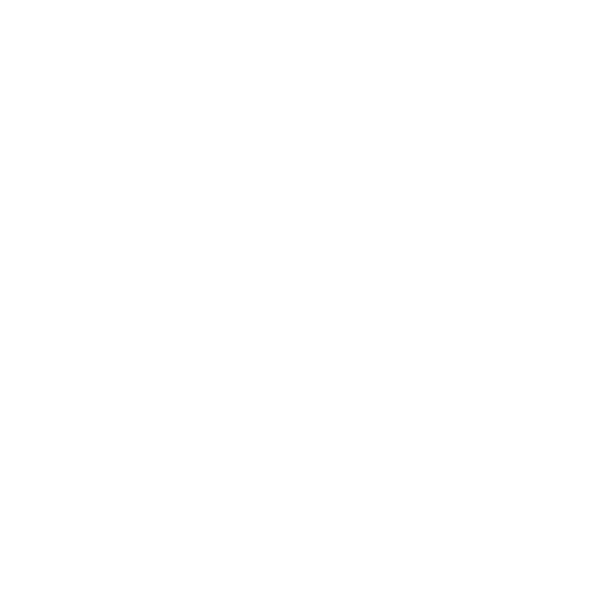

  

  
  
  

<!-- <h3 align="center">👨‍💻 [Your title here]</h3>

  <em>[Your introduction here]</em>

 -->

<samp>

  

<!--
###

  
  
  

-->
###

<!-- <h3 align="left">🚀 About Me</h3> -->
<!-- 

  Your introduction will go here

 -->

<h3 align="left">💼 Projects</h3>

<strong>🌸 <a href="https://github.com/junyjeon/preference">Perfume Recommendation Service</a></strong>

  
  
  

  - 📱 Perfume recommendation app built with Flutter and Neo4j graph database
  - 🤖 Implemented keyword extraction from user reviews using GPT-4
  - 🔍 Created graph-based recommendation system using extracted keywords

  <b>Tech Stack:</b>
  - Flutter, Riverpod, go_router
  - Neo4j graph database, GPT-4 API
  - Material Design 3

  <b>Key Features:</b>
  - AI-powered review keyword extraction
  - Graph visualization of perfume relationships
  - Personalized recommendations based on semantic analysis

<h3 align="left">🔨 Core Tech Stack</h3>

   C ⭐
  
   C++ ⭐
  
   Dart ⭐
  
   Flutter ⭐
  
   WSL ⭐
  
   Cursor ⭐

 

<strong>Full Tech Stack</strong>

Languages:

   C
  
   C++
  
   Rust
  
   Python
  
   JavaScript
  
   TypeScript
  
   Dart

LLM Models:

   GPT
  
   Claude
  
   Gemini
  
   Llama
  
   Deepseek
  
   Grok

LLM Tools:

   Langchain
  
   LangSmith

Search Engines:

   ElasticSearch
  
   Tantivy

Frontend:

   HTML5
  
   CSS3
  
   React
  
   TailwindCSS
  
   Bootstrap
  
   Flutter
  
   Electron
  
   Tauri 2.0

Design Tools:

   Figma
  
   Sketch

CMS:

   WordPress
  
   Webflow

Backend:

   FastAPI
  
   PostgreSQL
  
   MySQL
  
   Redis

Testing & Automation:

   Selenium
  
   BeautifulSoup4
  
   MacroRecord

DevOps:

   Git
  
   Make
  
   Docker
  
   AWS
  
   Nginx
  
   WSL

IDEs & Editors:

   Vim
  
   VSCode
  
   Cursor
  
   Xcode

Data Science:

   Jupyter

Game Development:

   Unreal Engine 5
  
   Unity 6

Operating Systems:

   Linux
  
   Ubuntu
  
   Debian
  
   Windows
  
   macOS

###

<!-- <h3 align="left">🔥   My Stats :</h3> -->
<!--
###

  
  
  
  
  
  
  

-->

###

<h2 align="center">📊 Stats</h2>

  

    
    
  

  

    
    
  

<h3 align="center">🐍 Contribution Activity</h3>

  

###
</samp>
